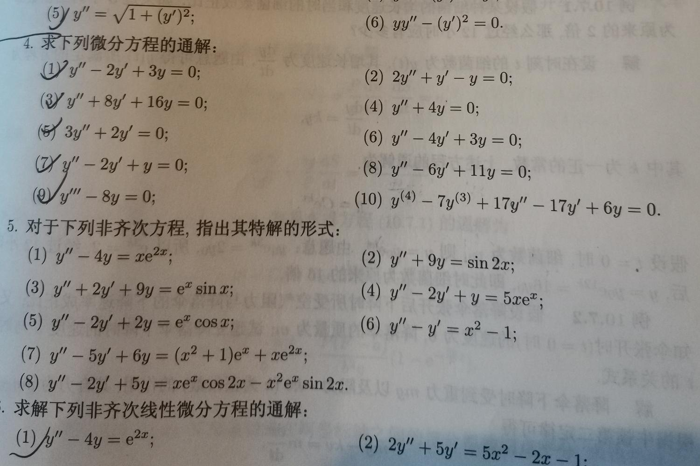
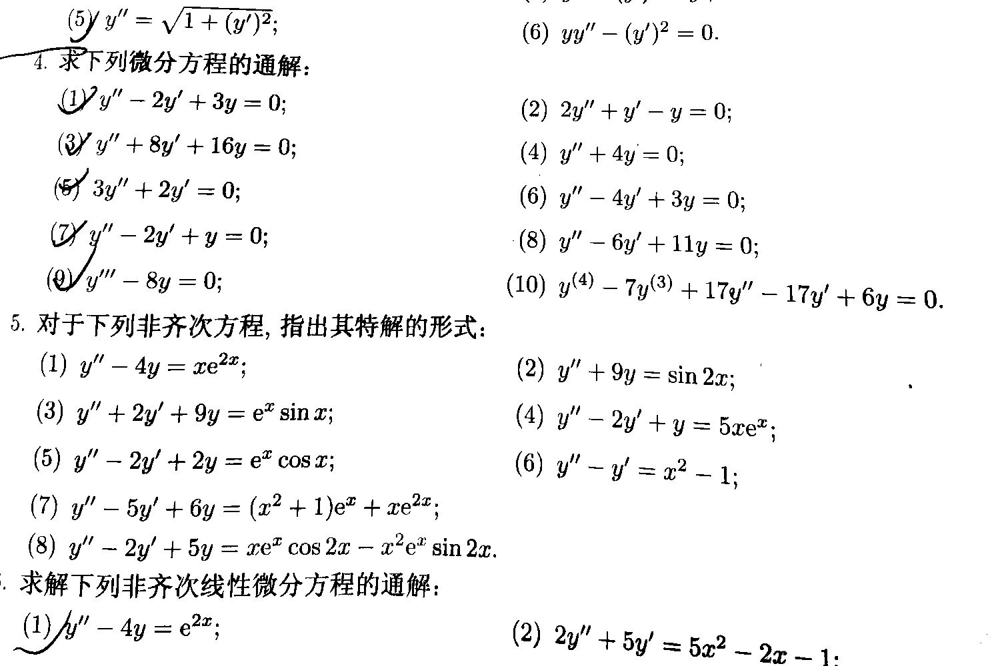

# Mannual for Plab

Plab for pictures, just like matlab for matrix.

Version 1.0.4

Last commit on 22th Nov, 2021.

Copyright (c) 2020~2021 by xsy, GPL v3 LICENSE.

## Introduction

Plab is a command line based image processing program which helps you modify your pictures. By specifying command line options, you can crop, rotate, mirror, scale the image, or adjust contrast, hue and brightness of it either manually or by using embedded options. You can also directly access ARGB value and change it freely.

The program is developed with Qt, so it is supposed to cross-platform.

To some extent, this program is more efficient than most image processing software on the market; it consumes much less resources and does equal or greater work. For example, when it comes to [text enhance](####-t intensity {gray/colorful} {pure/mixed}), I believe this program is much better than _CamScanner_ and _Acrobat_, especially when dealing with photos shot under bad lightening.

Not believing? See it with your own eyes.

before processing:



after processing:



And the process only takes about 0.5 seconds on a domestic CPU and occupies less than 50MB of memory. More examples are available in ./imgs .

## Usage

`plab input_source [option1 [arguments] [option2 [arguments] ... ]]`

for example:

```
# do pure text enhance with colors on imgs/img1.jpg after cropping to 1280*720 and scaling to 1920*1080
plab imgs/img1.jpg -c 0 0 1280 720 -s 1920 1080 -t 2 colorful pure

# do pure text enhance without colors on all images in folder 'imgs' and outputs to be placed in folder 'outputs' in the format of jpg
plab imgs -t 1 gray pure -f jpg -o outputs
```

### Input

<input_source> can be either an image file or a directory directly containing images. For the former, plab will check its existence and format, and, upon successful, read the image into memory; for the latter, it will do the same thing for all the image files directly in the directory. Note that folders in the target directory is omitted, even though it contains images. Both relative and absolute path will be accepted.

### Options & arguments

Program is executed in sequential order of options.

#### -a alpha_value

Add an alpha channel whose value is uniformly set to alpha_value.

#### -b scale

Adjust brightness. A value of 'scale' larger than 1 means brightening, while a negative one means the opposite. This is achieved by scaling all the r,g,b value with 'scale'.

#### -c x y width height

Crop under physical coordinate.

#### -d x y

RESERVED FOR DEBUGGING: print argb value of (x, y) during process.

#### -e scale

Enrich colors. A positive value of 'scale' means enriching, while a negative one means the opposite.

#### -f {png/jpg/tif/bmp ...}

Assign output format. The default value is png. Note that some formats don't support alpha value, so choose it wisely.

#### -g {average/min}

Convert the picture to a gray one. 'average' means setting all r,g,b value to average(r,g,b) , and 'min' means setting to min(r,g,b).

<!-- #### -h intensity

Text & figure sharpening, a powerful feature of Plab. Sometimes an image contains text and figure which is not very clear, in which situation Plab can sharpen it to make the text and figure much more clear. The background should be purely white, e.g.

If the image is too small, you can use option '-s' first to adjust its size to whatever you want. -->

#### -m {horizontal/vertical}

Mirror horizontally or vertically.

#### -p lR lG lB uR uG uB tR tG tB

Replace any pixel whose rgb value is between lower_bound (lR,lG,lB) and upper_bound(uR,uG,uB) with target (tR,tG,tB). BETWEEN means all R,G and B value of the pixel is between (lR,lG,lB) and (uR,uG,uB) respectively. For example, (60,150,30) is between (40,150,0) and (60,255,255), while (41,200,200) is not between them.

If lower_bound is equal to upper_bound, you can safely omit one of them. In that case, options and arguments should be `-p OR OG OB tR tG tB`.

#### -r {left/right/horizontal/vertical}

Rotate. 'Left' means counterclockwise and 'Right' means clockwise. If horizontal or vertical is specified, Plab will rotate the image to horizontal or vertical counterclockwise.

#### -s width height

Scale to target width and height. Recommended with option -h if it is text.

#### -t intensity {gray/colorful} {pure/mixed}

Text enhance, the most powerful feature of Plab. It changes vague pictures containing text which is inconvenient to read to a clear and elegant display of words.

'Intensity' is a non-negative integer which specifies intensity of the enhance. Typically a greater intensity means a clearer output, but may yield to unidentified behavior if set too large. The recommended range of intensity is {0,1,2,3}, yet in most cases '2' is the best choice.

You can select arguments in group {bw/gray/colorful} and {pure/mixed} respectively. If your picture is gray or it's ok even if the output is gray, you select 'gray' in the first group; otherwise 'colorful'. 'bw' is a special choice for outputting bitmap which only consists of black(0,0,0) and white(255,255,255), which function is still in experiment state. If your picture only contains text or you do not care about charts or photos in the picture, select 'pure'; otherwise 'mixed'. Plab will automatically choose suitable algorithm to perform the enhance.
